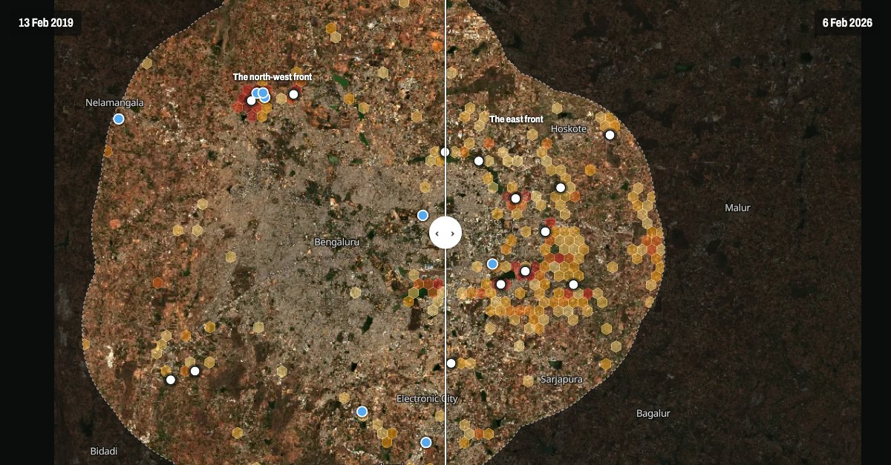

# Bengaluru green cover, 2019–2026

**Live site: https://bengaluru-green-cover.pages.dev**



Where Bengaluru's edge lost its green cover between February 2019 and February 2026, measured per
10 m pixel from free Sentinel-2 imagery and checked by eye. The 40 biggest losses were each
compared against eight dry seasons of photos: 30 held up, 11 of them inside one new layout
(Shivaram Karanth Layout, north-west) and 16 spread across the east from Varthur to Hoskote. A
separate check of the 30 m buffer around 590 mapped lakes found 8 with roads or buildings built
inside it.

The site's [How it was made](https://bengaluru-green-cover.pages.dev/method) page explains the
method and what it cannot see. [`PROJECT.md`](PROJECT.md) is the working log: every decision,
dead end and gotcha, in order.

By Aditya Goyal, October 2026. A side project.

## Layout

| Path | What's there |
|---|---|
| `site/` | The static site (MapLibre GL JS, no build step). `site/data/` holds what it reads. |
| `notebooks/` | The analysis, milestone by milestone, with outputs. `m2_loss_photo_check.ipynb` and `m4_ring_photo_check.ipynb` hold the photo-check verdicts. |
| `results/` | Tables the notebooks and site are built from, e.g. `m2_hex_table_masked.csv`, `m2_loss_verdicts.csv`, `m4_ring_verdicts.csv`. |
| `*.py` | One script per step; each starts with a docstring saying what it does. |
| `PROJECT.md` | Status, scope decisions, technical gotchas and the decision log. |

## Reproducing it

Needs Python 3.13 and a Google Cloud project with the Earth Engine API enabled.

```sh
python -m venv .venv && .venv/bin/pip install -r requirements.txt
earthengine authenticate
export EE_PROJECT=<your-project-id>
python check_setup.py                  # confirms Earth Engine works
python build_grid.py                   # study boundary + H3 hex grid  -> data/
python fetch_water.py                  # OSM water bodies               -> data/
python measure_hexes.py --mask-water   # greenness per hex per year     -> results/
python export_tiles.py                 # swipe photos                   -> site/data/tiles/
python export_vectors.py               # hexes, places, outlines        -> site/data/
python export_crops.py                 # card photos                    -> site/data/crops/
python site/serve.py                   # preview at http://localhost:8765
```

`data/` and the photo tiles are not committed; the scripts regenerate them. The lake-ring steps
(`measure_rings.py`, `measure_ring_greenness.py`) and the photo checks live in the M4 and M2
notebooks. `./deploy.sh` publishes `site/` to Cloudflare Pages.

## Licence

- **Code** (`*.py`, `site/*.js`, `site/*.html`, `site/*.css`): [MIT](LICENSE).
- **Results and writing** (`results/`, `notebooks/` outputs, the site's text and the place
  verdicts): [CC BY 4.0](https://creativecommons.org/licenses/by/4.0/) — reuse with credit to
  Aditya Goyal.
- **Third-party data keeps its own terms.** Sentinel-2 imagery: contains modified Copernicus
  Sentinel-2 data 2019–2026. Lake, water and place outlines derived from OpenStreetMap
  (`site/data/outlines.geojson`, `data/osm_*.geojson`): © OpenStreetMap contributors, under the
  [ODbL](https://opendatacommons.org/licenses/odbl/). Map labels: OpenFreeMap.
